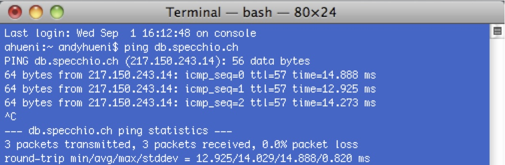

# FAQs

## Why is my connection to the online database failing?

The SPECCHIO online database is accessible on db.specchio.ch via port 4406. If
your firewall of your computer or institute blocks outgoing traffic to this
server and port, then a connection will fail. Test the connection to the
db.specchio.ch by using ping on the command line or terminal:

If the packets are lost, you probably got a firewall problem. Try to configure
your firewall accordingly or talk to your system administrator.

## Are my HR-1024 files supported?

Currently, the following restriction applies: the spectrum must be acquired
using the PDA software. Reason is that the laptop generated files have a
different file format, involving capturing dates formatted to the settings of
your laptop. If you think you need to read laptop generated files, drop an email
to [admin@specchio.ch](mailto:admin@specchio.ch) including a version of your
output file and we'll see what we can do about a generic reader. Furthermore,
the option to remove the overlap between detectors is configurable and can
result in differing band combinations from the same instrument. This is
currently not supported in SPECCHIO. If you have a useful use case for the
overlap cutting option, please provide us with the information on how to get the
new bands based on instrument configuration data contained in the spectral file.

## I've uploaded HR-1024 files. Why are the wavelengths wrong when I export the data?

Your particular instrument is not registered in the SPECCHIO database. In the
current version of SPECCHIO, default wavelengths values are selected if the
instrument is not defined (i.e. no instrument specific wavelength calibrations
are available). The reason why you cannot insert your own instruments is due to
the database rights that keep SPECCHIO in its relational, non-redundant state.
If you want your instrument added, send an email to
[admin@specchio.ch](mailto:admin@specchio.ch) with an HR-1024 example file
attached; also specify when the instrument was calibrated. We will add your
instrument definition to the database. This problem applied to V2 of SPECCHIO.

## I've transformed radiances into reflectances and exported them to a CSV file. Why can't I read the file properly in Matlab?

The output file can contain values like 'Infinity' and 'NaN', which is a problem
in Matlab, as the e.g. csvread expects numeric input only. This can be solved by
using an adapted reading routine for CSV files.
