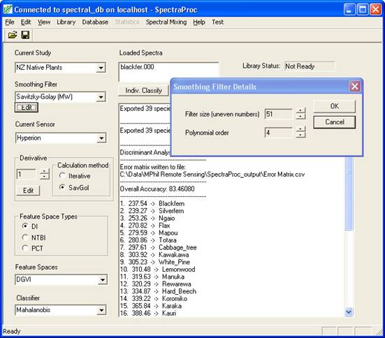

# SpectraProc Software

SpectraProc was specifically designed with the goal to provide fast, repeatable
processing of ASD FieldSpec Pro spectral data files and is bundled with a MySQL
database for the storage of the spectral data and pre-processing information.
SpectraProc handles the tedious processes of data organisation and standard
pre-processing, thus providing a boost of productivity increase to the
spectroscopist. Entire field campaigns can be loaded into the system in minutes
enabling a first analysis almost instantaneous. SpectraProc runs only under
Microsoft Windows.

## Feature list

- Automated loading of spectral files into the spectral database
- Grouping of data into a hierarchical structure of studies, species, sites and spectra
- Waveband filtering to cut e.g. waterband noise
- Savitzky-Golay smoothing
- Sensor synthesizing (Spectral convolution) (e.g. Hyperion, Landsat7 TM)
- Derivative calculation
- Feature space transformations (DGVI type indices, NDVI type indices, Principal Component Transformation)
- Classification
- Separability measure (JM and B distance)
- PCA
- Extensive file export functions (CSV, ENVI spectral library, ARFF)
- Connectivity to centralized database server
- Classification of single ASD spectra
- Basic unmixing algorithm
- Easy definition of new sensor for the sensor synthesizing operation

## Intended audience

Researchers interested in applying a number of processing steps to ASD
spectrometer data without programming these algorithms. 

Researchers who intend to apply their own algorithms are better off by using
SPECCHIO and coding their algorithms in a higher level language. 

## SpectraProc Downloads

For details on installing and running SpectraProc please see [SpectraProcUserGuide_V02.pdf](https://github.com/SPECCHIODB/Guides/blob/master/SpectraProcUserGuide_V02.pdf)

The SpectraProc installation package can be downloaded here: [SpectraProc V1.2.zip](/guides/assets/SpectraProc_V1.2.zip)

## SpectraProc GUI Screenshot

## References

Hueni, A. (2006). Field Spectroradiometer Data: Acquisition, Organisation,
Processing and Analysis on the Example of New Zealand Native Plants. Institute
of Natural Resources. Palmerston North, Massey University. 
[MSc Thesis](http://www.geo.uzh.ch/microsite/rslpapers/paper/2006/Hueni,%202006,%20Field%20Spectroradiometer%20Data%20Acquisition,%20Organisation,%20Processing%20and%20Analysis%20on%20the%20Example%20of%20New%20Zealand%20Native%20Plants.pdf)

Hueni, A. and Tuohy, M. (2006). "Spectroradiometer Data Structuring,
Pre-Processing and Analysis - An IT Based Approach." Journal of Spatial Science
51(2): 93-102. [Article on Research Gate](https://www.researchgate.net/publication/228882904_Spectroradiometer_data_structuring_pre-processing_and_analysis_-_An_IT_based_approach)
